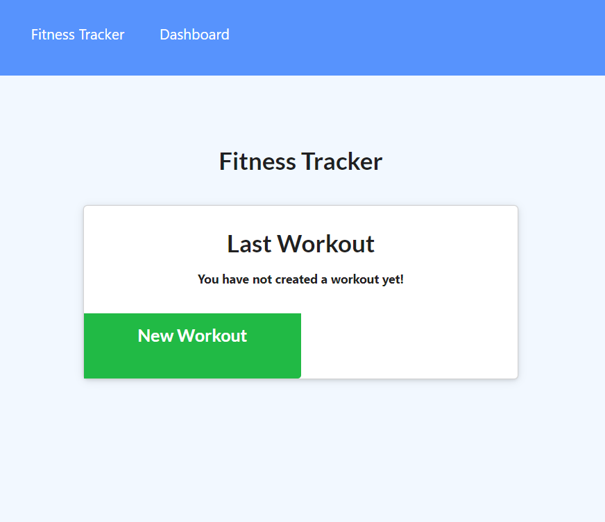
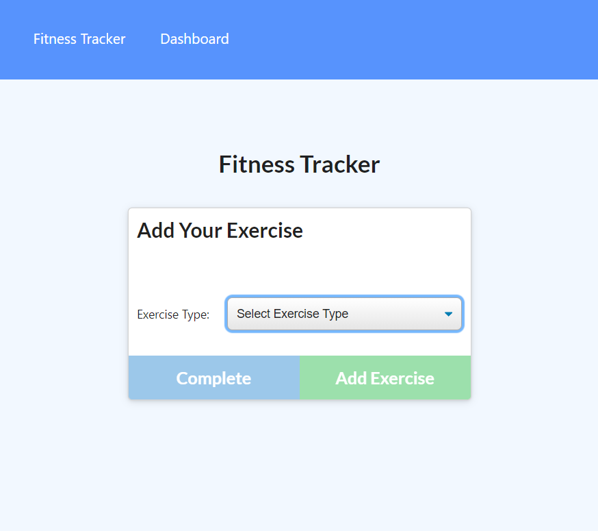
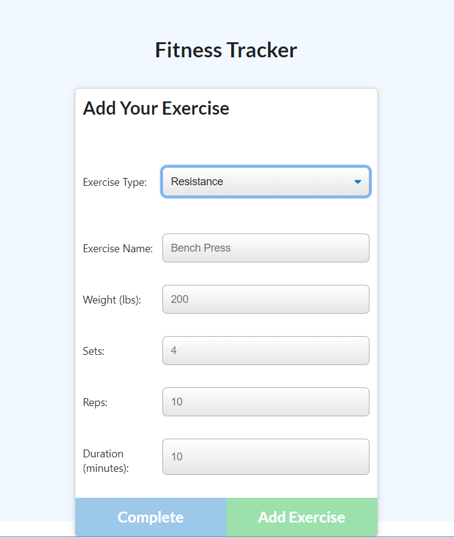
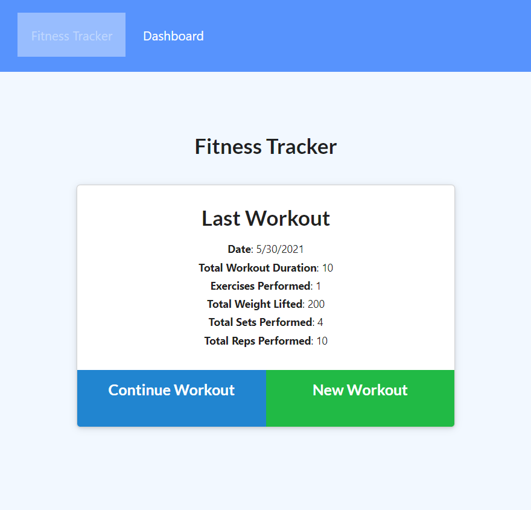
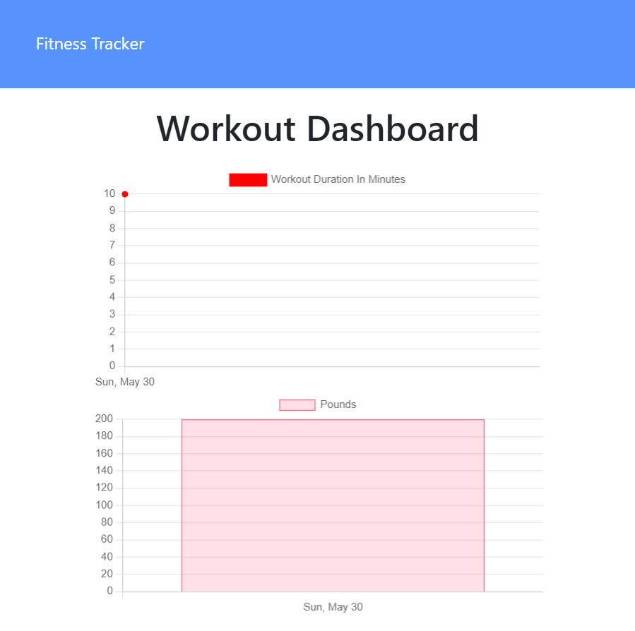

# Fitness_Tracker

## Description

This is a fitness tracker app that can help the users tracking their daily/weekly workouts. The users are able to record their exercise between resistance or cardio. The users can go to the dashboard to see their workout progress.

## Instruction

On the main page, you are able to start a workout record by clicking New Workout. If you have made a workout record before then there will be an option to continue your workout progress.

Select the kind of workout you want to record.

After the workout has been recorded, you will be taken back to the main page with a list of your workout progress.

Go to the dashboard and you can see both charts that track your workout time and weights.

## Deployment

[Fitness Tracker](https://fitness-tracker131.herokuapp.com/)
